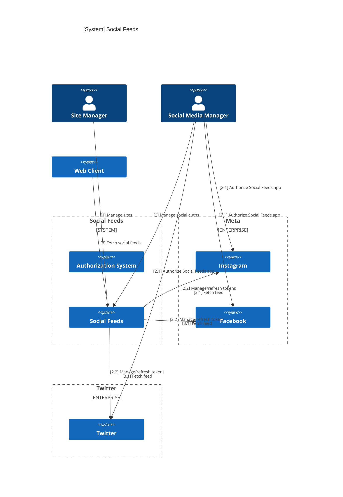
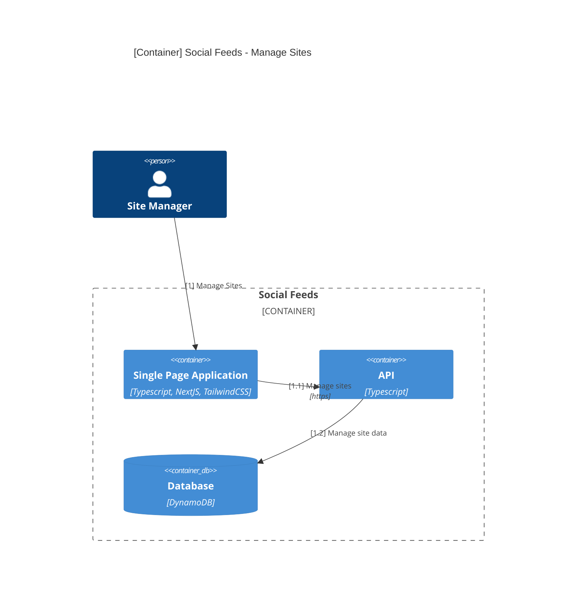
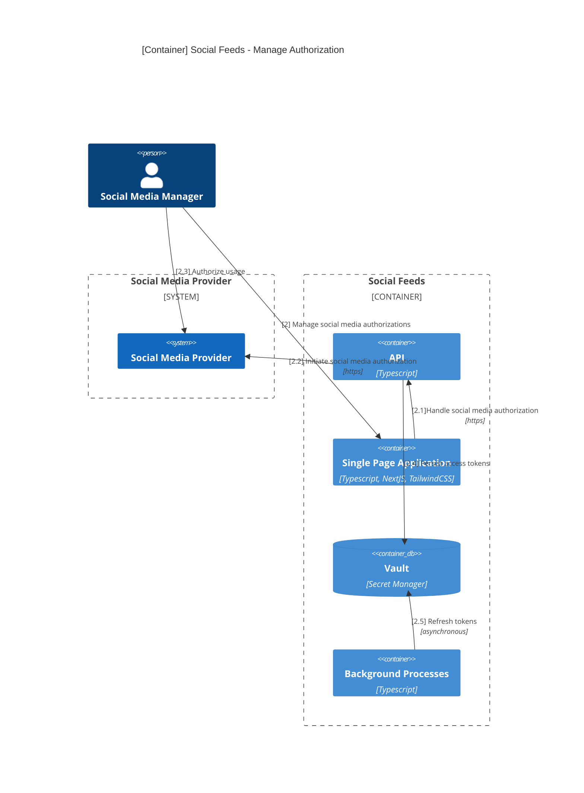
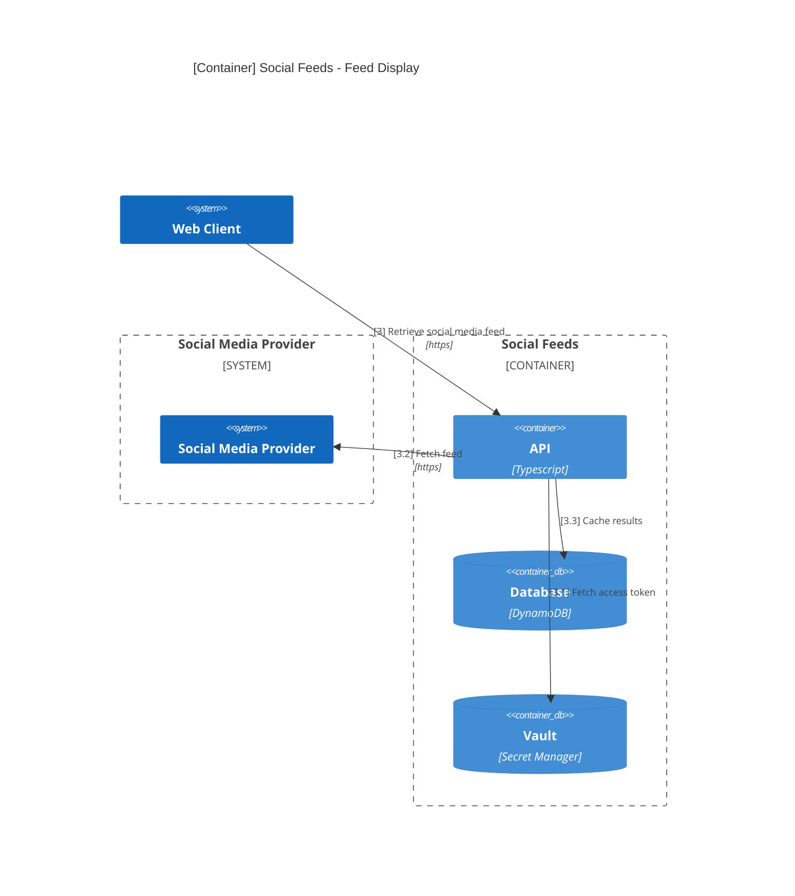

# Application

## Introduction

This document describes the application point of view of the Social Feeds application.

## Assumptions

N/A

## General Context

### Objectives

This application will allow for static websites and applications to access social media feeds without requiring a custom backend to manage access tokens.

### Existing

There are competing SaaS products and CMS plugins that fulfill this purpose, but are cost prohibitive for use in small projects.

### Actors

##### Administrator

Provisions and manages user accounts for the application.

##### Site Owner

Provisions and manages sites. Initiates requests for social media authentication.

##### Social Media Manager

Owner of the social media accounts being managed.

##### Web Client

The website / UI consuming the exposed social media feed.

## Constraints

### Budget

* Application must fit entirely within the AWS free tier.

### Legal

* Application must comply with Meta, other provider TOS's.

## Requirements

* Application must be multi-tenant (Organizations)
* Application must support basic RBAC
* Application must allow Organizations to create new Sites
* Application must allow Social Media Providers to be added to Sites
* Application must provide an API to retrieve Feeds from Social Media Providers

## Target Architecture

### General Application Architecture

The Application will allow Site Managers to create and manage one or more websites' social media integrations. Site Managers may initiate requests for authorization from a social media provider. Social Media Managers will respond to those requests by completing the providers' authorization flows.

The backend will have a serverless architecture, implemented as small functions backed by various AWS and third party SaaS solutions. The UI will be a SPA.

### Detailed Application Architecture

Most experiences, unless specified otherwise, will happen via the SPA making synchronous HTTP requests to the API.

##### Administration

Administrator will interact directly with AWS Cognito to provision/deprovision user accounts.

##### Site Management

Site management includes the following experiences:

* billing overview
* security overview
* provision a new site
* deprovision an existing site
* adding social media providers to a site
* removing social media providers from a site

###### Billing Overview

The Billing Overview will allow the Site Manager to see a breakdown of the cost of each individual site, user, and social provider they have provisioned in their Organization.

The SPA will query the API for general organization stats and the pricing table for the organization, which will then be merged for display.

###### Security Overview

The Security Overview will allow the Site Manager to see a breakdown of the individual users in their organization and allow them to assign specific roles and permissions to each one.

The SPA will query the API for organization users and their permissions. These may then be modified via additional synchronous HTTP requests.

###### Provision a New Site

This experience will allow the Site Manager to provision a new site under their Organization.

###### Deprovision an Existing Site

This experience will allow the Site Manager to remove a site from their Organization (and deprovision all underlying AWS resources).

###### Add Social Media Provider to Site

This experience will allow the Site Manager to add a social media capability to one of their existing sites.

###### Remove Social Media Provider from Site

This experience will allow the Site Manager to remove a social media capability from one of their existing sites.

##### Social Media Management

Social Media Manager will interact with the site via a SPA. The SPA will provide the following experiences:

* Authorize a Social Media Provider for a Site

###### Authorize a Social Media Provider for a Site

This experience will allow a Social Media Manager to authorize Social Feeds to pull media from a Social Media Provider via the providers' individual authorization flows.

The SPA will perform app authorization via one or more redirects, with part of this experience taking place on the providers' sites.

##### Feed Display

Web Client will interact with this API to pull social media feeds for a given site. This API may synchronously reach out to the social media providers to pull a fresh feed or pull it from cache depending on the time since last request.

