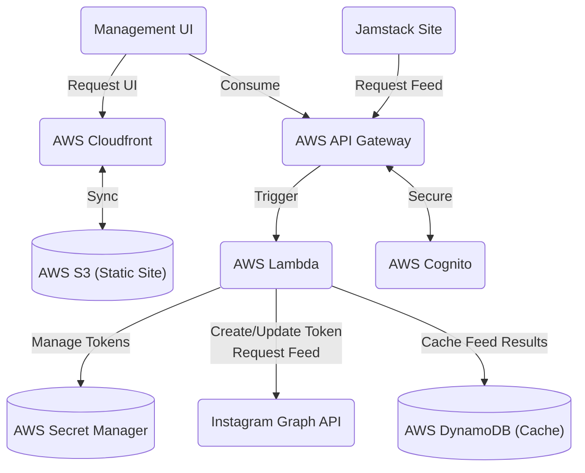

```mermaid
graph TD;
    %% AWS Services %%
    Gateway("AWS API Gateway")
    Lambda("AWS Lambda")
    Assets[("AWS S3 (Static Site)")]
    Cache[("AWS DynamoDB (Cache)")]
    Secret[("AWS Secret Manager")]
    Cloudfront("AWS Cloudfront")
    Cognito("AWS Cognito")
    
    %% Social Services %%
    Instagram("Instagram Graph API")
    
    %% Other %%
    Management("Management UI")
    BFF("Jamstack Site")

    %% Graph %%
    Management -- Request UI --> Cloudfront;
    Cloudfront <-- Sync --> Assets;
    
    Management -- Consume --> Gateway;
    Gateway -- Trigger --> Lambda;
    Gateway <-- Secure --> Cognito;
    Lambda -- Manage Tokens --> Secret;
    Lambda -- "Create/Update Token<br/>Request Feed" --> Instagram;
    Lambda -- Cache Feed Results --> Cache;
    
    BFF -- Request Feed --> Gateway;
```